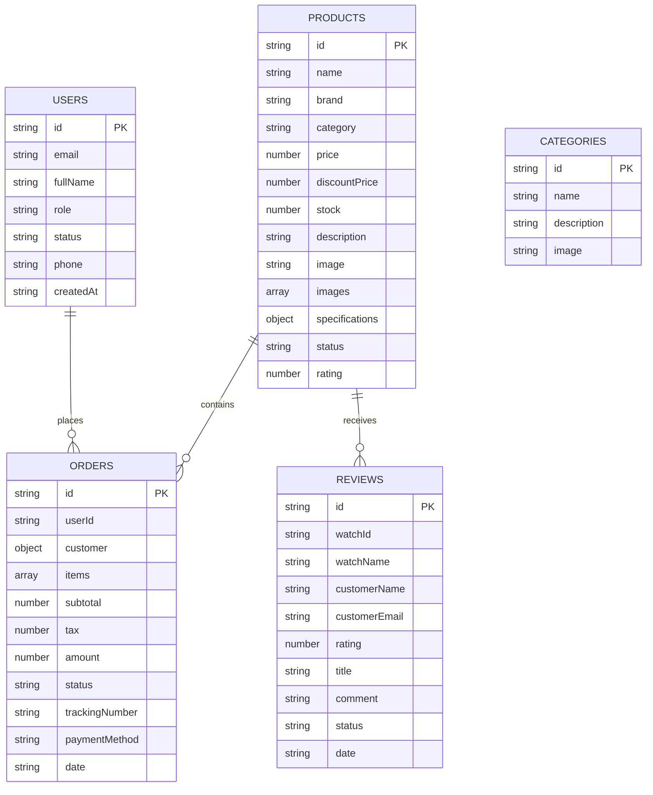
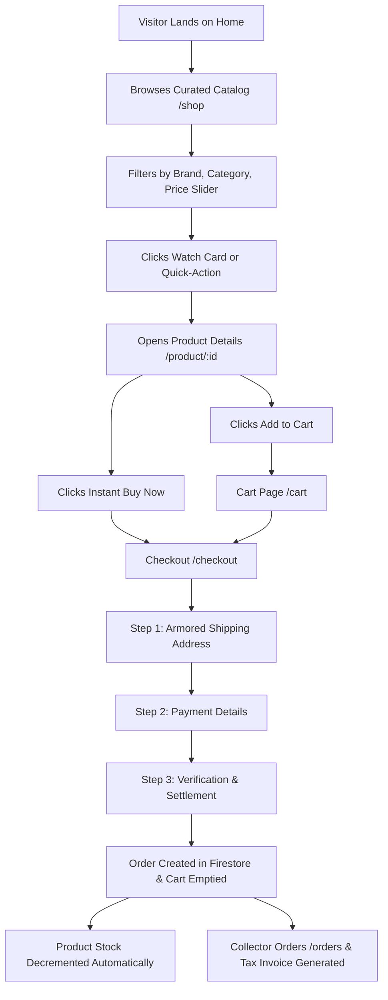
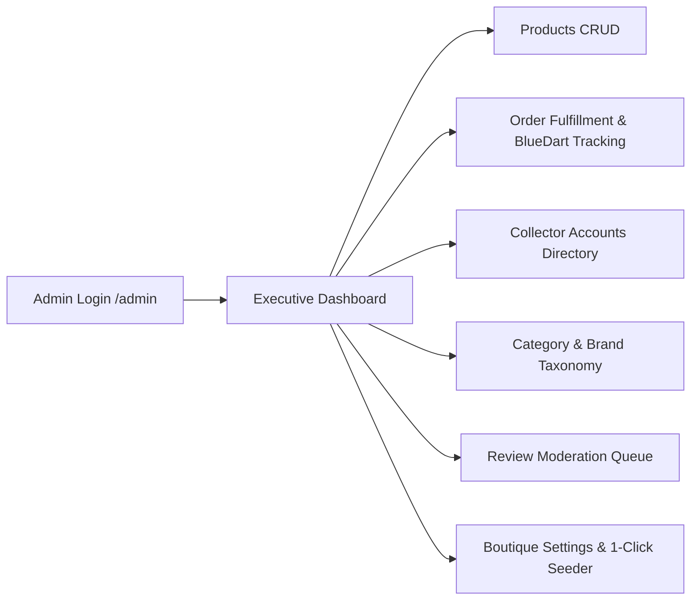

# 🏛️ WRISTORA — Comprehensive Project Master Documentation & Viva/Interview Guide

---

## 📖 Table of Contents
1. **Executive Summary & Project Overview**
2. **Technology Stack & Architecture**
3. **Directory Structure & Component Map**
4. **State Management & Global Contexts**
5. **Database Architecture & dbService CRUD Layer**
6. **End-to-End User Storefront Workflows**
7. **End-to-End Admin Management Workflows**
8. **Mathematical & Business Logic Formulas**
9. **Security, Route Guards & Validation Mechanisms**
10. **Mentor / Sir Q&A Viva Defense Cheat Sheet**

---

## 1. Executive Summary & Project Overview

**Wristora** is a full-stack, bespoke **Haute Horlogerie luxury e-commerce boutique and back-office management system**. Built for high-end timepiece collectors and boutique administrators, it replicates the digital standard of luxury houses like *Rolex, Omega, Audemars Piguet, and Patek Philippe*.

### Core Capabilities:
* **Customer Storefront**: Catalog curation, multi-parameter filtering, interactive calibre blueprint specifications, live customer review submissions, persistent cart & wishlist, 3-step armored checkout, and printable tax invoices.
* **Administrative Cockpit**: Executive KPI analytics, products catalog CRUD with in-table stock adjusters, 5-step watch wizard, order fulfillment pipeline with BlueDart tracking, customer directory with lifetime spend aggregation, review moderation, and 1-click database seeding.
* **Hybrid Data Architecture**: Real-time Firebase Firestore database with an automated, offline-resilient `localStorage` synchronization layer.

---

## 2. Technology Stack & Architecture

| Layer | Technology | Rationale & Usage |
| :--- | :--- | :--- |
| **Frontend Framework** | **React 18** (Vite SPA) | Ultra-fast Hot Module Replacement (HMR), component-driven UI, optimal bundle chunking. |
| **Styling & Design System**| **Tailwind CSS v4** | Bespoke luxury theme (`luxury-charcoal`, `luxury-gold`, `luxury-cream`), typography styling. |
| **Routing & Navigation** | **React Router DOM v6** | Nested route layouts (`UserLayout`, `AdminLayout`), route guards (`ProtectedRoute`, `AdminRoute`), automatic scroll restoration. |
| **Cloud Database** | **Firebase Firestore** | NoSQL cloud document storage for `products`, `orders`, `users`, `categories`, and `reviews`. |
| **Authentication** | **Firebase Auth** | Email/Password authentication & Google OAuth Provider integration. |
| **State Management** | **React Context API** | `AuthContext` (User session & roles) + `CartContext` (Cart & Wishlist reactive synchronization). |
| **Icons & Media** | **Lucide React** | Clean vector iconography. |

---

## 3. Directory Structure & Component Map

```text
Wristora/
├── public/                     # Static assets (brand logo, favicon, banners)
├── src/
│   ├── assets/                 # Local media assets
│   ├── components/
│   │   ├── common/             # Reusable Atomic UI Elements
│   │   │   ├── Button.jsx      # Primary, secondary, outline, danger button variants
│   │   │   ├── Input.jsx       # Labelled input wrapper with error states
│   │   │   ├── Modal.jsx       # Accessible popup dialog backdrop
│   │   │   ├── Loader.jsx      # Luxury spinner & loading indicator
│   │   │   └── EmptyState.jsx  # Zero-state placeholder with CTA trigger
│   │   └── layout/             # Shell Layout Wrappers
│   │       ├── Navbar.jsx      # Header with search, auth avatar, cart & wishlist badges
│   │       ├── Footer.jsx      # Multi-column footer with newsletter subscription
│   │       ├── UserLayout.jsx  # Storefront shell + automatic scroll-to-top
│   │       └── AdminLayout.jsx # Fixed dark navigation sidebar + workspace header
│   ├── context/
│   │   ├── AuthContext.jsx     # User authentication, Google Sign-in, role checking
│   │   └── CartContext.jsx     # Global Cart & Wishlist state with localStorage sync
│   ├── firebase/
│   │   ├── firebaseConfig.js   # Firebase SDK initialization & credentials
│   │   └── dbService.js        # Centralized CRUD methods for all 5 collections
│   ├── pages/
│   │   ├── auth/
│   │   │   ├── Login.jsx       # Split-screen luxury collector sign-in
│   │   │   └── Register.jsx    # Split-screen collector account registration
│   │   ├── user/
│   │   │   ├── Home.jsx        # Hero showcase, trust badges, top 3 featured models
│   │   │   ├── Shop.jsx        # Curated catalog, fixed filter sidebar, quick actions
│   │   │   ├── ProductDetails.jsx # Multi-angle gallery, blueprint tabs, live reviews
│   │   │   ├── Wishlist.jsx    # Saved bookmarks with 1-click "Move to Cart"
│   │   │   ├── Cart.jsx        # Line items, quantity steppers, 18% GST calculation
│   │   │   ├── Checkout.jsx    # 3-step checkout with strict input formatting
│   │   │   ├── Orders.jsx      # Customer purchase receipts & invoice modals
│   │   │   └── Profile.jsx     # Profile editor, addresses, security settings
│   │   ├── admin/
│   │   │   ├── Dashboard.jsx   # Executive KPIs, revenue chart, low-stock alerts
│   │   │   ├── Products.jsx    # Catalog table with in-table stock adjusters
│   │   │   ├── AddProduct.jsx  # 5-step watch curation wizard + live preview card
│   │   │   ├── EditProduct.jsx # Watch updater loaded with Firestore data
│   │   │   ├── Categories.jsx  # Category & brand taxonomy with live count tallies
│   │   │   ├── Orders.jsx      # Order pipeline, BlueDart tracking, tax invoice generator
│   │   │   ├── Users.jsx       # Consolidated collector accounts & lifetime spend
│   │   │   ├── Reviews.jsx     # Live review moderation queue
│   │   │   └── Settings.jsx    # Boutique configuration & 1-click Cloud Seeder
│   │   └── common/
│   │       └── NotFound.jsx    # Bespoke 404 "Coordinates Unknown" screen
│   ├── routes/
│   │   ├── routes.jsx          # Central React Router configuration
│   │   ├── ProtectedRoute.jsx  # Route guard for authenticated customer pages
│   │   └── AdminRoute.jsx      # Route guard restricting access to admin accounts
│   ├── App.jsx                 # App root wrapped in AuthProvider & CartProvider
│   └── main.jsx                # DOM mounting point
├── package.json
└── vite.config.js
```

---

## 4. State Management & Global Contexts

### 1. `AuthContext.jsx` (User Session & Security)
* **What it does**: Manages `currentUser`, `userProfile`, `isAdmin`, and `isLoading`.
* **Key Functions**:
  * `login(email, password)`: Authenticates via Firebase Auth (falls back to demo accounts if offline).
  * `register(email, password, fullName)`: Registers new user in Firebase Auth & writes document to Firestore `users` collection.
  * `loginWithGoogle()`: Launches Google OAuth popup provider.
  * `logout()`: Clears active session and resets memory state.
  * `isAdmin`: Boolean derived by verifying if user role is `'admin'` or email matches administrative credentials.

### 2. `CartContext.jsx` (Global Reactive Cart & Wishlist)
* **What it does**: Provides persistent shopping cart and wishlist bookmarks synchronized to browser `localStorage`.
* **Key Functions**:
  * `addToCart(product, quantity)`: Appends or increments item quantity up to available product stock.
  * `updateCartQuantity(productId, quantity)`: Modifies quantity with dynamic boundaries ($1 \le \text{qty} \le \text{stock}$).
  * `removeFromCart(productId)`: Removes specific line item.
  * `clearCart()`: Empties the cart (triggered automatically upon order checkout).
  * `toggleWishlist(product)`: Adds or removes timepiece from favorites.
  * `isInWishlist(productId)`: Returns boolean to render filled/unfilled gold heart icons.
  * `cartCount` / `wishlistCount`: Reactive count numbers displayed as badge chips in Navbar.
  * `cartSubtotal`: Dynamically computed sum of all line item totals.

---

## 5. Database Architecture & `dbService.js` CRUD Layer

`dbService.js` acts as the single source of truth for all database queries. It uses a **Hybrid Resilience Pattern**: it writes to Firebase Firestore if connected; if network issues or unconfigured Firebase keys occur, it seamlessly falls back to browser `localStorage`.

### 🗄️ Firestore Collections & Data Schemas



---

## 6. End-to-End User Storefront Workflows



### Key Functional Features:
1. **Interactive Product Details (`ProductDetails.jsx`)**:
   * **Multi-Angle Gallery**: High-res thumbnail switcher.
   * **Horological Provenance Tab**: Narrative craftsmanship story & 4 visual feature badges (*Sapphire Crystal, Calibre, Hermetic Seal, Master Vault*).
   * **Technical Blueprint Tab**: 4-quadrant specification matrix (*Movement, Case, Dial/Strap, Provenance*).
   * **Live Review Tab**: Real-time sentiment rating meter and interactive review submission modal.
   * **You May Also Admire**: Related watches recommendations.
2. **Armored Checkout (`Checkout.jsx`)**:
   * Auto-fills from saved profile data.
   * Strict input formatters: 16-digit card number (auto-spaced in groups of 4), `MM/YY` 4-character expiry, 3-digit CVV, 10-digit phone, 6-digit postal code.
   * Decrements product stock in database upon submission.

---

## 7. End-to-End Admin Management Workflows



### Key Administrative Features:
1. **Executive Dashboard (`Dashboard.jsx`)**:
   * Real-time Gross Revenue calculation ($\sum \text{Orders Amount}$).
   * Total Orders, Active Models, and Low Stock Watchlist ($\le 8$ units).
   * Monthly revenue trajectory bars and recent dispatches stream.
2. **Products Manager (`Products.jsx`, `AddProduct.jsx`, `EditProduct.jsx`)**:
   * In-table instant stock adjusters (`+`/`-`).
   * 5-step watch creation wizard with real-time live preview card.
3. **Order Fulfillment (`Orders.jsx`)**:
   * Status updater (`Processing` $\rightarrow$ `Shipped` $\rightarrow$ `Delivered` $\rightarrow$ `Cancelled`).
   * BlueDart tracking ID assigner.
   * **Cancelling an order automatically restores watch stock back to the catalog**.
   * Official printable Tax Invoice manifest.
4. **Collector Accounts Directory (`Users.jsx`)**:
   * Aggregates registered accounts **and** unique order buyers.
   * Computes individual lifetime spend and auto-assigns VIP Collector tiers ($\ge ₹20,00,000$).
5. **Review Moderation (`Reviews.jsx`)**:
   * 1-click Approve (Publish), Flag, or Archive customer reviews.
6. **1-Click Database Seeder (`Settings.jsx`)**:
   * `seedDatabase()` injects luxury models, categories, dispatches, and initial reviews into Firestore with one click.

---

## 8. Mathematical & Business Logic Formulas

### 1. Inventory Stock Reduction & Restoration
$$\text{On Purchase: } \text{Stock}_{\text{new}} = \max(0, \text{Stock}_{\text{current}} - \text{Quantity}_{\text{purchased}})$$
$$\text{On Order Cancellation: } \text{Stock}_{\text{restored}} = \text{Stock}_{\text{current}} + \text{Quantity}_{\text{purchased}}$$

### 2. Pricing, Taxes & Invoicing
$$\text{Line Item Total} = (\text{Discount Price || Regular Price}) \times \text{Quantity}$$
$$\text{Cart Subtotal} = \sum \text{Line Item Totals}$$
$$\text{Integrated GST (18\%)} = \text{Math.round}(\text{Subtotal} \times 0.18)$$
$$\text{Grand Total} = \text{Subtotal} + \text{Complimentary Armored Shipping (₹0)} + \text{GST}$$

### 3. Collector Lifetime Spend & Tier Allocation
$$\text{Total Spend} = \sum_{\text{user orders}} \text{Order Amount}$$
$$\text{Tier} = \begin{cases} \text{VIP Collector} & \text{if Total Spend} \ge ₹20,00,000 \\ \text{Verified Collector} & \text{if Orders Count} > 0 \\ \text{Member} & \text{otherwise} \end{cases}$$

### 4. Dynamic Sentiment Rating
$$\text{Average Watch Rating} = \frac{\sum \text{Star Ratings}}{\text{Total Reviews Count}}$$

---

## 9. Security, Route Guards & Validation Mechanisms

1. **Route Protection (`ProtectedRoute.jsx`, `AdminRoute.jsx`)**:
   * `<ProtectedRoute>`: Intercepts unauthenticated users trying to access `/checkout`, `/orders`, or `/profile`, preserving the attempted path in `location.state` so they return directly after login.
   * `<AdminRoute>`: Verifies `isAdmin === true`; unauthorized users are redirected to the homepage.
2. **Fixed Sidebar Shells**:
   * Admin sidebar is `fixed w-64 h-screen`—does not scroll away when viewing long tables.
   * Shop filter sidebar is `sticky top-24 self-start` for effortless catalog browsing.
3. **Route Scroll Restoration**:
   * `UserLayout.jsx` automatically calls `window.scrollTo(0, 0)` on every route change.
4. **Input Masking & Form Defense**:
   * Strict regex pattern verification on card expiry (`MM/YY`), CVV (`3 digits`), phone numbers (`10 digits`), and postal pincodes (`6 digits`).

---

## 10. Mentor / Sir Q&A Defense Cheat Sheet

If your sir or interviewer asks questions during project review, use these concise, expert answers:

### ❓ Q1: "What architecture did you use for state management?"
> **Answer**: "We utilized React's Context API with two primary providers: `AuthContext` for global session management and role-based access control, and `CartContext` for cart and wishlist state. Both contexts feature bidirectional synchronization with `localStorage` for offline state persistence."

### ❓ Q2: "How does your project handle database operations and offline cases?"
> **Answer**: "All database operations are centralized inside `dbService.js` using a hybrid resilience pattern. It queries Firebase Firestore for real-time cloud data. If Firebase is offline or unconfigured, it seamlessly falls back to `localStorage` without throwing errors or breaking the UI."

### ❓ Q3: "What happens to the inventory when an order is placed or cancelled?"
> **Answer**: "When `createOrder()` is called at checkout, it iterates over all purchased line items and automatically decrements the `stock` count in the `products` table. If an administrator cancels an order in `/admin/orders`, `updateOrderStatus()` automatically recovers the units and adds them back to the catalog inventory."

### ❓ Q4: "How is the Admin Users list able to show both registered users and buyers?"
> **Answer**: "The `getAllUsers()` method aggregates documents from the Firestore `users` collection and cross-references them with customer records inside the `orders` collection. It computes completed order counts and total lifetime spend dynamically."

### ❓ Q5: "How are protected routes and admin authorization secured?"
> **Answer**: "We implemented `<ProtectedRoute>` and `<AdminRoute>` wrappers inside React Router. `<AdminRoute>` evaluates `isAdmin` from `AuthContext`. If a non-admin attempts to access `/admin/*`, they are redirected to the storefront root."

### ❓ Q6: "How did you design the Haute Horlogerie aesthetic?"
> **Answer**: "We configured Tailwind CSS with a luxury palette consisting of Deep Charcoal (`#121212`), Warm Gold (`#D4AF37`), and Swiss Ivory Cream (`#F9F6F0`), pairing Serif headings (`Cinzel` / `Playfair`) with Sans-serif technical typography (`Inter`), accompanied by custom 404 screens, interactive blueprints, and fixed sidebars."

---

*Documentation compiled and verified for Wristora Project Submission.*
